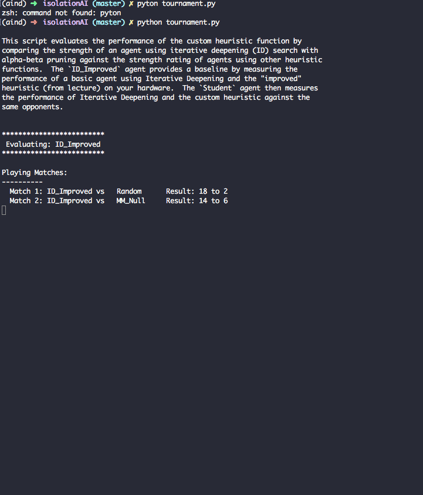
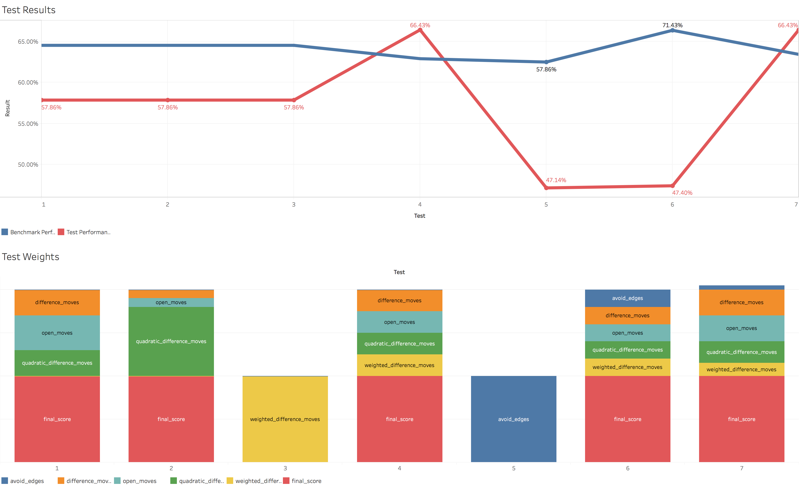

## isolationAI

The second project in the [Artificial Intelligence Nanodegree program](https://classroom.udacity.com/nanodegrees/nd889/syllabus), designed to exlpore game-playing agents via the game [Isolation](http://sashazd.herokuapp.com/projects/2014/12/12/isolation-player-centric-game-ai/).



## Methodology
This was implemented via the **Minimax**, **Iterative Deepening**, and **Alpha Beta pruning**, which organizes games into opposing turns maximizing or minimizing their own evaluation function, maximizing on that players that turn. From there, it's a matter of developing your own unique **Heuristics** to help improve performance (by allowing one to approximate the value of different board states via different **evaluation functions**). This component of the project is detailed below, alongside the test and learn results. 

## Heuristics



### Evaluation Functions
```python 
    def open_moves(myMoves):
        """
        Objective: All available moves; given from open_move_score() in the example.

        Reasoning: N/A.
        """

    def difference_moves(myMoves, opponentMoves):
        Objective: Difference between your moves and the opponent moves; given from improved_score() in the example.

        Reasoning: N/A.
        """

    def quadratic_difference_moves(myMoves, opponentMoves):
        """
        Objective: Difference between your moves and opponent moves, squared. 

        Reasoning: The difference_moves() function does not adequately acknowledge negative situations (when the opponent has more moves than you), so perhaps squaring might help. 
        """

    def weighted_difference_moves(myMoves, opponentMoves, weight):
        """
        Objective: Weighting the number of by a factor to make the value more dangerous. 

        Reasoning: It was hinted at during the lectures, but perhaps penalizing the opponent by weighting their moves more heavily might make us more reactive to any changes in their position.
        """

    def avoid_edges(myMoves, opponentMoves):
        """
        Objective: Attemps to make the center of the board less valuable than the edges.  

        Reasoning: A personal experiment to see whether the edges of the board were significantly more valuable than the center, and penalizing moves that favored that center. Turned out to not perform very well.
        """

    def final_score(heur1_weight, heur2_weight, heur3_weight, heur4_weight, heur5_weight):
        """
        Objective: Weights all evaluation function by certain values to yield a final score.

        Reasoning: Easily my favorite heuristic here; why have just one when you can have a weighted average of all the positions, and allow multiple factors to inform your final score? 
        """

```

### Results
All the functions were developed and tested with `tournament.py`, and the weights (`0.3, 0.4, 0.5, ...`) correspond with weighted percntages (`30%, 40%, 50%, ...`) which yielded the following results:

#### Test 1: `final_score(0.4, 0.3, 0.3)`
Attemps quasi-equal weights with the three original functions. 

```
    # ID_Improved         65.00%
    # Student             57.86%
```
So far, performing worse than the test agent. Still, nice to see the weighted average thing might actually work. Perhaps if we try the new quadratic variant? 

#### Test 2: `final_score(0.1, 0.1, 0.8)`
This one favours the quadratic variant much more than the first two.

```
    # ID_Improved         52.14%
    # Student             54.29%
```
It seems squaring is useful, but only marginally. Now let's try some new heuristics. 

#### Test 3: `final_score(0, 0, 0, 1)`
This weighting favours the fourth heuristic, which attemps to penalize the opponents number of moves.

```
    # ID_Improved         52.14%
    # Student             52.86%
```
It did sub par. Maybe if we incorporate the old ones again? 

#### Test 4: `final_score(0.25, 0.25, 0.25, 0.25)`
This one favours all four available heuristics. 

```
    # ID_Improved         59.29%
    # Student             66.43%
``` 
Alright, weighting them all was worth it! I am very happy with the weighted average heuristic, but let's try building another. 

#### Test 5: `final_score(0, 0, 0, 0, 1)`
This one favours the fifth heuristic. Spoiler alert: it doesn't do very well, but luckily the tests discovered that pretty quickly: 

```
    # ID_Improved         57.86%
    # Student             47.14%
```
#### Test 6: `final_score(0.2, 0.2, 0.2, 0.2, 0.2)`
This one goes back to the old approach of favouring all the functions; what happens if we mix it in with the other evaluation functions? 

```
    # ID_Improved         71.43%
    # Student             47.14%
```
Wow, that's pretty rough.  

#### Test 7: `final_score(0.3, 0.3, 0.25, 0.15, 0.0)`
Let's drop it for a new system favouring our original heuristics, instead of this new experiments. 

```
    # ID_Improved         61.14%
    # Student             66.43%
```
So it seems the heuristics we've deployed so far have worked, but my last experiment was a bust. If I were to continue, I would probably revert to Test 4 and iterate from that if I were to continue. 
